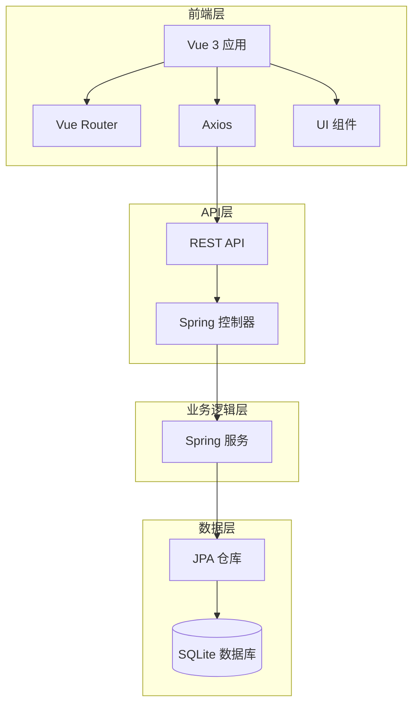

# JavaFX 到 Vue 前端转换计划

## 项目概述

本计划将基于 Spring Boot + JavaFX 的宠物管理系统桌面应用转换为使用 Vue 作为前端框架的 Web 应用，保留原有的 Java 后端 API。

## 现有功能分析

### JavaFX 功能模块

1. **仪表盘 (Dashboard)**
   - 今日营收统计
   - 活跃顾客数量
   - 待办任务
   - 月度目标
   - 每周目标进度条
   - 快速操作按钮

2. **顾客管理 (Customer)**
   - 顾客列表展示
   - 添加/编辑/删除顾客
   - 搜索功能
   - 照片上传/查看/删除
   - 统计信息展示

3. **财务管理 (Finance)**
   - 交易记录列表
   - 添加/编辑/删除交易
   - 搜索交易
   - 计算提成
   - 统计信息

4. **员工管理 (Clerk)**
   - 员工列表展示
   - 添加/编辑/删除员工
   - 提成率设置
   - 照片管理

5. **报表中心 (Report)**
   - 生成日报表/月报表/年报表
   - 导出 PDF
   - Excel 导出（待完善）
   - 销售图表生成

6. **系统设置 (Settings)**
   - 应用程序设置

7. **关于 (About)**
   - 应用信息展示

## Vue 前端架构设计

### 技术栈

- **前端框架**: Vue 3
- **路由**: Vue Router
- **状态管理**: Pinia (可选)
- **HTTP 客户端**: Axios
- **UI 组件库**: Element Plus
- **图表库**: ECharts
- **构建工具**: Vite

### 文件结构

```
frontend/
├── src/
│   ├── api/              # API 接口
│   │   ├── customer.js
│   │   ├── transaction.js
│   │   ├── clerk.js
│   │   ├── dashboard.js
│   │   └── report.js
│   ├── components/       # 通用组件
│   │   ├── Layout.vue    # 主布局
│   │   ├── Navbar.vue    # 导航栏
│   │   └── Sidebar.vue   # 侧边栏
│   ├── views/            # 页面组件
│   │   ├── Dashboard.vue
│   │   ├── Customers.vue
│   │   ├── Transactions.vue
│   │   ├── Clerks.vue
│   │   ├── Reports.vue
│   │   ├── Settings.vue
│   │   └── About.vue
│   ├── router/           # 路由配置
│   ├── store/            # 状态管理
│   ├── utils/            # 工具函数
│   └── assets/           # 静态资源
```

## API 端点规划

### 仪表盘 API

```
GET    /api/dashboard          # 获取仪表盘数据
```

### 顾客管理 API

```
GET    /api/customers               # 获取所有顾客
GET    /api/customers/{id}          # 获取单个顾客
POST   /api/customers               # 创建顾客
PUT    /api/customers/{id}          # 更新顾客
DELETE /api/customers/{id}          # 删除顾客
GET    /api/customers/search        # 搜索顾客
POST   /api/customers/{id}/photos   # 上传照片
GET    /api/customers/{id}/photos   # 获取照片列表
DELETE /api/customers/photos/{id}   # 删除照片
```

### 交易管理 API

```
GET    /api/transactions               # 获取所有交易
GET    /api/transactions/{id}          # 获取单个交易
POST   /api/transactions               # 创建交易
PUT    /api/transactions/{id}          # 更新交易
DELETE /api/transactions/{id}          # 删除交易
GET    /api/transactions/search        # 搜索交易
GET    /api/transactions/commission    # 计算总提成
```

### 员工管理 API

```
GET    /api/clerks               # 获取所有员工
GET    /api/clerks/{id}          # 获取单个员工
POST   /api/clerks               # 创建员工
PUT    /api/clerks/{id}          # 更新员工
DELETE /api/clerks/{id}          # 删除员工
```

### 报表 API

```
GET    /api/reports/daily         # 生成日报表
GET    /api/reports/monthly       # 生成月报表
GET    /api/reports/annual        # 生成年报表
GET    /api/reports/export/pdf    # 导出 PDF
GET    /api/reports/export/excel  # 导出 Excel
GET    /api/reports/chart         # 获取图表数据
```

## 实现计划

### 第一阶段：基础设施搭建

1. 完善 Vue 项目配置
2. 创建主布局组件
3. 配置路由
4. 配置 Axios 基础设置

### 第二阶段：核心页面实现

1. 仪表盘页面
2. 顾客管理页面
3. 交易管理页面
4. 员工管理页面
5. 报表中心页面
6. 设置页面
7. 关于页面

### 第三阶段：后端 API 完善

1. 创建缺失的 API 控制器
2. 完善现有 API 功能
3. 实现文件上传处理
4. 实现报表导出功能

### 第四阶段：集成与测试

1. 前后端集成测试
2. 功能测试
3. 用户体验优化

## 架构图



## 注意事项

1. 保留所有现有的 Java 后端服务和数据模型
2. 确保 API 兼容性，不破坏现有功能
3. 渐进式迁移，可以并行运行两个版本
4. 保持用户体验的一致性

