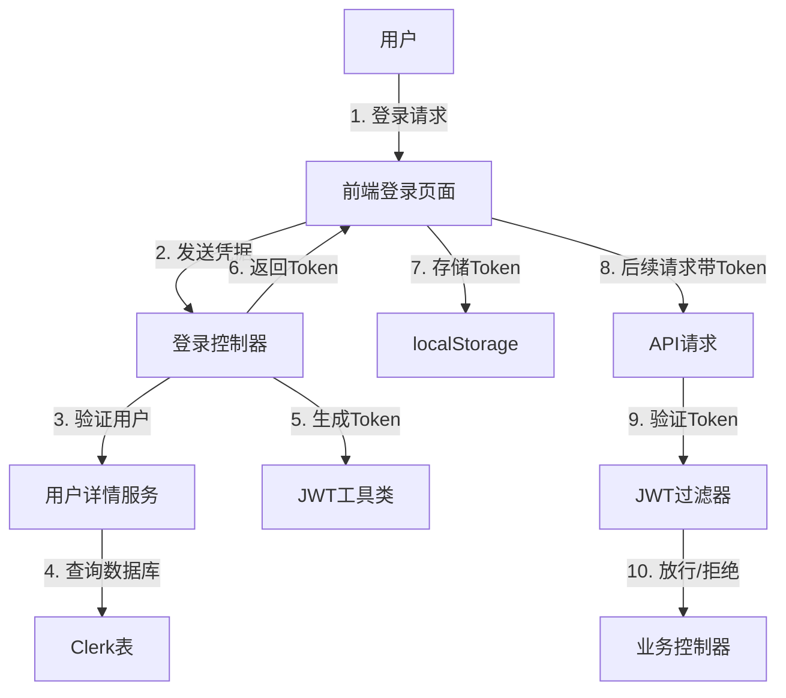

# Spring Security + JWT 认证系统实现方案

## 概述

为pet管理系统添加完整的用户认证和授权功能，确保系统安全。

## 系统架构

## 后端实现

### 1. 数据模型扩展

**更新 Clerk.java**
- 添加 `username` 字段（唯一）
- 添加 `password` 字段（加密存储）
- 添加 `enabled` 字段（账户启用状态）

### 2. 依赖添加

**pom.xml** 新增依赖：
- `spring-boot-starter-security`
- `jjwt-api`, `jjwt-impl`, `jjwt-jackson`

### 3. 核心组件

**JwtUtil.java** - JWT工具类
- 生成Token
- 验证Token
- 从Token提取信息

**SecurityConfig.java** - Spring Security配置
- 配置密码加密器（BCrypt）
- 配置JWT过滤器
- 配置白名单路径（登录接口等）

**JwtAuthenticationFilter.java** - JWT认证过滤器
- 从请求头提取Token
- 验证Token有效性
- 设置认证信息到SecurityContext

**ClerkDetailsService.java** - 用户详情服务
- 实现UserDetailsService接口
- 根据用户名加载用户信息

**AuthController.java** - 认证控制器
- `/api/auth/login` - 登录接口
- `/api/auth/register` - 注册接口（可选）

## 前端实现

### 1. 登录页面

**Login.vue**
- 用户名/密码输入表单
- 登录状态管理
- 错误提示

### 2. 路由守卫

**router/index.js**
- 添加全局前置守卫
- 检查token是否存在
- 未登录用户重定向到登录页

### 3. API请求拦截器

**request.js**
- 请求拦截器：自动添加Authorization头
- 响应拦截器：处理401未授权

### 4. 状态管理

**store/**（可选）
- 管理用户登录状态
- 存储用户信息

## API接口设计

| 路径 | 方法 | 说明 | 认证 |
|------|------|------|------|
| `/api/auth/login` | POST | 用户登录 | 否 |
| `/api/auth/me` | GET | 获取当前用户信息 | 是 |
| `/api/*` | * | 其他业务接口 | 是 |

## 安全特性

✅ 密码BCrypt加密存储  
✅ JWT无状态认证  
✅ Token过期机制  
✅ 路由级权限控制  
✅ API接口权限保护  
✅ CORS跨域配置  

## 初始数据

系统启动时自动创建默认管理员账户：
- 用户名：`admin`
- 密码：`admin123`
- 首次登录后建议修改密码

## 文件清单

**后端文件：**
- `src/main/java/com/pet/management/model/Clerk.java` (更新)
- `src/main/java/com/pet/management/config/SecurityConfig.java` (新增)
- `src/main/java/com/pet/management/security/JwtUtil.java` (新增)
- `src/main/java/com/pet/management/security/JwtAuthenticationFilter.java` (新增)
- `src/main/java/com/pet/management/security/ClerkDetailsService.java` (新增)
- `src/main/java/com/pet/management/controller/AuthController.java` (新增)

**前端文件：**
- `frontend/src/views/Login.vue` (新增)
- `frontend/src/router/index.js` (更新)
- `frontend/src/utils/request.js` (更新)
