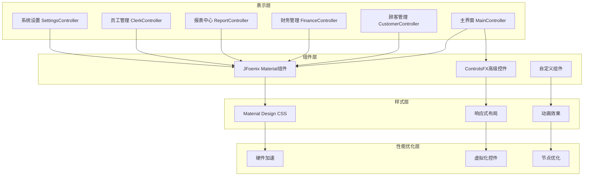

# 宠物管理系统UI重新设计架构文档

## 1. 项目概述

本次UI重新设计旨在将宠物管理系统升级为现代化Material Design风格界面，提升用户体验和系统性能。

### 技术栈
- **UI组件库**: JFoenix (Material Design) + ControlsFX
- **框架**: JavaFX + Spring Boot
- **数据库**: SQLite

## 2. 架构设计

### 2.1 整体架构图



## 3. 详细设计方案

### 3.1 依赖配置

#### pom.xml新增依赖
```xml
<!-- JFoenix Material Design -->
<dependency>
    <groupId>com.jfoenix</groupId>
    <artifactId>jfoenix</artifactId>
    <version>9.0.10</version>
</dependency>

<!-- ControlsFX -->
<dependency>
    <groupId>org.controlsfx</groupId>
    <artifactId>controlsfx</artifactId>
    <version>11.1.2</version>
</dependency>
```

### 3.2 Material Design配色方案

| 用途 | 颜色值 | 说明 |
|------|--------|------|
| 主色调 | #2196F3 | Material Blue 500 |
| 深色主色 | #1976D2 | Material Blue 700 |
| 强调色 | #FF5722 | Material Deep Orange 500 |
| 背景色 | #FAFAFA | 浅灰背景 |
| 卡片色 | #FFFFFF | 白色卡片 |
| 文字主色 | #212121 | 深灰文字 |
| 文字辅色 | #757575 | 中灰文字 |
| 分割线 | #BDBDBD | 浅灰分割线 |
| 成功 | #4CAF50 | Material Green 500 |
| 警告 | #FFC107 | Material Amber 500 |
| 危险 | #F44336 | Material Red 500 |

### 3.3 界面组件升级方案

#### 主界面 (main.fxml)
- 使用 `JFXDrawer` 实现侧栏滑动
- 使用 `JFXToolbar` 替换传统工具栏
- 新增Material Design波纹效果
- 实现响应式布局适配

#### 顾客管理 (customer.fxml)
- 使用 `JFXTextField` 替换传统文本框
- 使用 `JFXButton` 实现Material按钮
- 使用 `ControlsFX TableView2` 实现虚拟化表格
- 添加浮动搜索栏和筛选面板

#### 通用改进
- 所有表单使用 `JFXDialog` 替代传统弹窗
- 添加进度指示器 `JFXSpinner`
- 实现Toast通知系统

### 3.4 性能优化策略

#### 3.4.1 硬件加速
```java
// 在MainApplication中启用
System.setProperty("prism.order", "d3d,sw");
System.setProperty("prism.forceGPU", "true");
```

#### 3.4.2 节点优化
- 减少不必要的嵌套布局
- 使用 `Group` 替代 `Pane` 用于静态内容
- 避免频繁的 `setStyle()` 调用

#### 3.4.3 虚拟化控件
- 大数据量表格使用虚拟化滚动
- 图片懒加载和缩略图缓存

#### 3.4.4 动画优化
- 使用 `Timeline` 替代 `Transition`
- 禁用不必要的 `autoReverse`
- 合理设置 `cycleCount`

### 3.5 用户体验改进

#### 3.5.1 按钮排序原则
- 高频操作靠左排列
- 主要操作使用强调色
- 危险操作添加确认对话框

#### 3.5.2 状态反馈
- 操作成功显示绿色Toast
- 操作失败显示红色Toast
- 加载中显示进度指示器

#### 3.5.3 视觉一致性
- 统一卡片阴影效果 `dropshadow(gaussian, rgba(0,0,0,0.12), 10, 0, 0, 2)`
- 统一间距 8px/16px/24px
- 统一圆角 4px/8px

## 4. 实施步骤

| 阶段 | 任务 | 预计工作量 |
|------|------|-----------|
| 1 | 依赖配置和项目结构调整 | 小 |
| 2 | Material Design CSS系统创建 | 中 |
| 3 | 主界面重新设计 | 中 |
| 4 | 顾客管理界面重新设计 | 中 |
| 5 | 其他模块界面重新设计 | 大 |
| 6 | 性能优化实现 | 中 |
| 7 | 响应式设计实现 | 中 |
| 8 | 用户体验优化 | 小 |
| 9 | 测试和验证 | 中 |

## 5. 兼容性考虑

- 保持现有功能完整性
- 数据库结构不变
- API接口保持兼容
- 支持Java 17+

## 6. 后续扩展

- 深色模式支持
- 主题切换功能
- 更多图表类型
- 国际化支持
