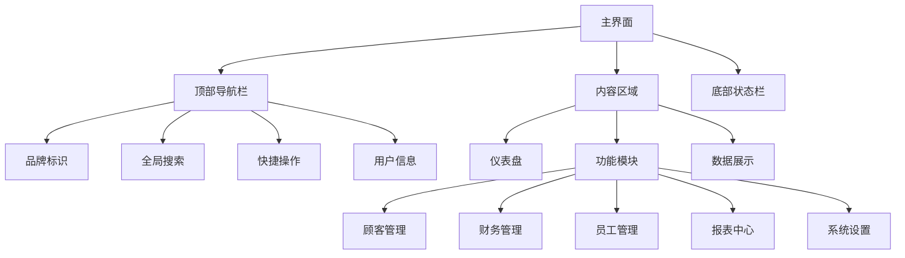
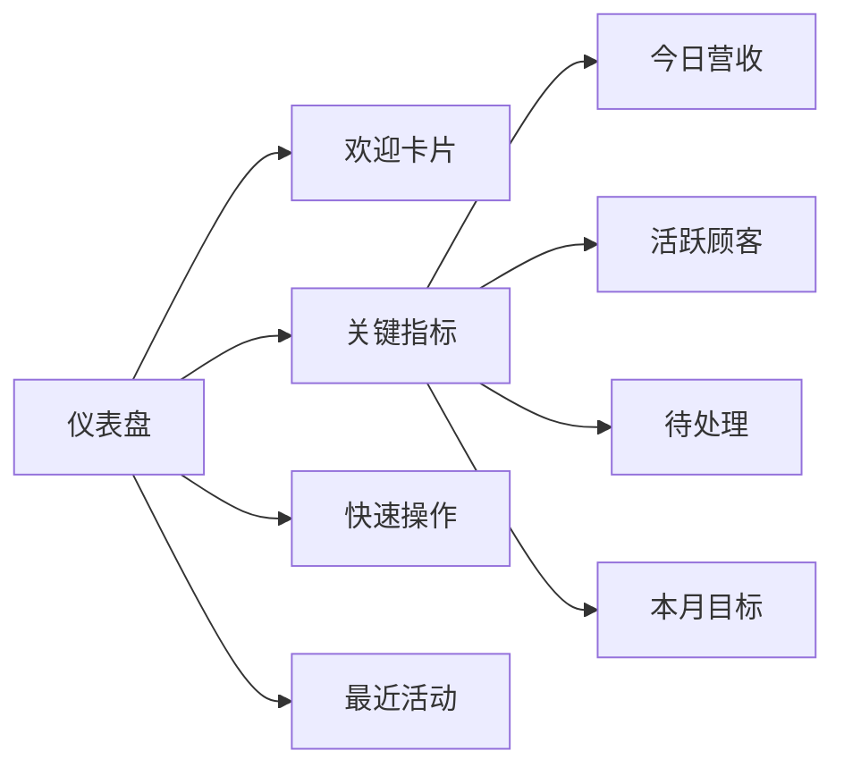
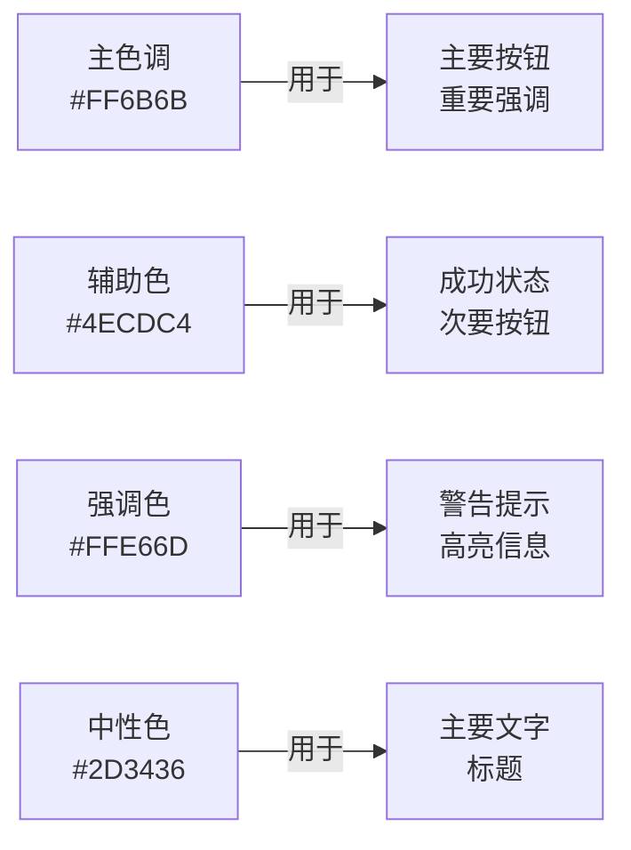

# 宠物管理系统 UI 重新设计方案

## 一、设计理念与用户体验分析

### 当前设计的问题分析
1. **导航体验**：侧边栏过于厚重，信息层次不够清晰
2. **数据展示**：统计卡片缺少视觉引导，数据关联性不强
3. **交互反馈**：操作反馈不够即时，缺乏微动画
4. **信息密度**：表格信息密度过高，关键数据不够突出
5. **色彩系统**：蓝色主色调虽然专业但缺乏情感共鸣

### 新设计的核心原则
1. **简约而不简单**：减少视觉噪音，突出核心功能
2. **数据优先**：让关键数据一目了然，支持快速决策
3. **流畅交互**：添加自然的微动画，提升操作愉悦感
4. **情感化设计**：采用温暖的色彩，增强用户归属感
5. **高效操作**：优化操作路径，减少点击次数

---

## 二、新的设计架构



---

## 三、具体界面设计方案

### 1. 主界面重构（main.fxml）

#### 新的布局结构
```xml
<BorderPane styleClass="modern-root">
    <!-- 顶部导航栏 - 更加简洁 -->
    <top>
        <HBox styleClass="modern-header">
            <!-- 品牌标识 -->
            <HBox styleClass="brand-section">
                <Label styleClass="brand-icon" text="🐾" />
                <Label styleClass="brand-title" text="宠物管家" />
            </HBox>
            
            <!-- 全局搜索 -->
            <HBox styleClass="search-section" HBox.hgrow="ALWAYS">
                <TextField styleClass="modern-search" promptText="搜索顾客、宠物、交易..." />
            </HBox>
            
            <!-- 快捷操作 -->
            <HBox styleClass="quick-actions">
                <Button styleClass="quick-btn" text="➕ 新顾客" />
                <Button styleClass="quick-btn" text="💰 新交易" />
            </HBox>
            
            <!-- 用户/系统信息 -->
            <HBox styleClass="user-section">
                <Label styleClass="time-display" fx:id="currentTime" />
                <Button styleClass="icon-btn" text="⚙" />
            </HBox>
        </HBox>
    </top>
    
    <!-- 左侧功能导航 - 改为标签页式 -->
    <left>
        <VBox styleClass="modern-sidebar">
            <!-- 导航标签 -->
            <VBox styleClass="nav-tabs">
                <Button styleClass="nav-tab active" text="📊 仪表盘" />
                <Button styleClass="nav-tab" text="👥 顾客" />
                <Button styleClass="nav-tab" text="💰 财务" />
                <Button styleClass="nav-tab" text="👨‍💼 员工" />
                <Button styleClass="nav-tab" text="📈 报表" />
            </VBox>
            
            <!-- 底部设置 -->
            <VBox styleClass="nav-footer">
                <Button styleClass="nav-tab" text="⚙️ 设置" />
            </VBox>
        </VBox>
    </left>
    
    <!-- 主内容区域 -->
    <center>
        <StackPane fx:id="contentPane" styleClass="modern-content" />
    </center>
</BorderPane>
```

#### 新的配色方案（modern-design.css）
```css
/* 新的配色系统 - 温暖而专业 */
* {
    --primary: #FF6B6B;           /* 温暖的珊瑚红 */
    --primary-dark: #EE5A5A;
    --primary-light: #FFE5E5;
    --secondary: #4ECDC4;         /* 清新的青绿色 */
    --accent: #FFE66D;            /* 明亮的黄色 */
    --background: #F8F9FA;
    --surface: #FFFFFF;
    --text-primary: #2D3436;
    --text-secondary: #636E72;
    --text-muted: #B2BEC3;
    --success: #00B894;
    --warning: #FDCB6E;
    --danger: #FF7675;
    --info: #74B9FF;
}

/* 现代化阴影 */
.shadow-sm {
    -fx-effect: dropshadow(gaussian, rgba(0,0,0,0.04), 6, 0, 0, 2);
}
.shadow-md {
    -fx-effect: dropshadow(gaussian, rgba(0,0,0,0.08), 12, 0, 0, 4);
}
.shadow-lg {
    -fx-effect: dropshadow(gaussian, rgba(0,0,0,0.12), 20, 0, 0, 8);
}

/* 圆角系统 */
.rounded-sm { -fx-background-radius: 4; }
.rounded-md { -fx-background-radius: 8; }
.rounded-lg { -fx-background-radius: 12; }
.rounded-xl { -fx-background-radius: 16; }
.rounded-full { -fx-background-radius: 9999; }
```

---

### 2. 仪表盘设计（新增）

#### 布局结构


#### 关键指标卡片设计
```xml
<!-- 统计卡片网格 -->
<GridPane styleClass="stats-grid" hgap="16" vgap="16">
    <!-- 今日营收 -->
    <VBox styleClass="stat-card primary" GridPane.columnIndex="0" GridPane.rowIndex="0">
        <HBox alignment="CENTER_LEFT" spacing="12">
            <Region styleClass="stat-icon revenue-icon" />
            <VBox spacing="4">
                <Label styleClass="stat-label" text="今日营收" />
                <Label styleClass="stat-value" text="¥12,580" />
                <Label styleClass="stat-trend up" text="↑ 12.5%" />
            </VBox>
        </HBox>
    </VBox>
    
    <!-- 活跃顾客 -->
    <VBox styleClass="stat-card success" GridPane.columnIndex="1" GridPane.rowIndex="0">
        <!-- 类似结构 -->
    </VBox>
    
    <!-- 待处理 -->
    <VBox styleClass="stat-card warning" GridPane.columnIndex="2" GridPane.rowIndex="0">
        <!-- 类似结构 -->
    </VBox>
    
    <!-- 本月目标 -->
    <VBox styleClass="stat-card info" GridPane.columnIndex="3" GridPane.rowIndex="0">
        <!-- 类似结构 -->
    </VBox>
</GridPane>
```

---

### 3. 顾客管理页面重构（customer.fxml）

#### 新的布局设计
```xml
<VBox styleClass="page-container" spacing="20">
    <!-- 页面标题与操作 -->
    <HBox styleClass="page-header" alignment="CENTER_LEFT">
        <VBox spacing="4">
            <Label styleClass="page-title" text="顾客管理" />
            <Label styleClass="page-subtitle" text="管理您的顾客信息和宠物档案" />
        </VBox>
        <Region HBox.hgrow="ALWAYS" />
        <HBox spacing="12">
            <Button styleClass="btn-secondary" text="📥 导入" />
            <Button styleClass="btn-primary" text="➕ 添加顾客" />
        </HBox>
    </HBox>
    
    <!-- 筛选与搜索 -->
    <HBox styleClass="filter-bar" spacing="12">
        <TextField styleClass="search-input" promptText="搜索顾客姓名、电话、宠物名..." />
        <ComboBox styleClass="filter-select" promptText="宠物类型" />
        <ComboBox styleClass="filter-select" promptText="活跃度" />
        <Button styleClass="btn-ghost" text="重置筛选" />
    </HBox>
    
    <!-- 顾客列表 - 卡片视图可选 -->
    <TabPane styleClass="view-toggle">
        <Tab styleClass="view-tab" text="📋 列表视图">
            <!-- 表格视图 -->
        </Tab>
        <Tab styleClass="view-tab" text="🃏 卡片视图">
            <!-- 卡片视图 -->
        </Tab>
    </TabPane>
</VBox>
```

#### 顾客卡片设计
```xml
<!-- 顾客卡片 -->
<VBox styleClass="customer-card" spacing="12">
    <!-- 头部 - 顾客信息 -->
    <HBox alignment="CENTER_LEFT" spacing="12">
        <Region styleClass="customer-avatar" />
        <VBox spacing="2" HBox.hgrow="ALWAYS">
            <HBox alignment="CENTER_LEFT" spacing="8">
                <Label styleClass="customer-name" text="张三" />
                <Label styleClass="customer-tag vip" text="VIP" />
            </HBox>
            <Label styleClass="customer-phone" text="138-8888-8888" />
        </VBox>
        <MenuButton styleClass="menu-btn" text="⋯" />
    </HBox>
    
    <!-- 宠物信息 -->
    <HBox styleClass="pet-section" spacing="8">
        <Label styleClass="pet-icon" text="🐕" />
        <VBox spacing="2">
            <Label styleClass="pet-name" text="毛毛" />
            <Label styleClass="pet-info" text="金毛犬 · 3岁" />
        </VBox>
    </HBox>
    
    <!-- 底部 - 状态与操作 -->
    <HBox alignment="CENTER_LEFT" spacing="8">
        <Label styleClass="last-visit" text="最后到访: 昨天" />
        <Region HBox.hgrow="ALWAYS" />
        <Button styleClass="btn-small" text="查看详情" />
    </HBox>
</VBox>
```

---

### 4. 财务管理页面重构（finance.fxml）

#### 数据可视化增强
```xml
<VBox styleClass="page-container" spacing="20">
    <!-- 页面头部 -->
    <HBox styleClass="page-header" alignment="CENTER_LEFT">
        <VBox spacing="4">
            <Label styleClass="page-title" text="财务管理" />
            <Label styleClass="page-subtitle" text="营收、支出、提成一目了然" />
        </VBox>
        <Region HBox.hgrow="ALWAYS" />
        <HBox spacing="8">
            <DatePicker styleClass="date-picker" />
            <Button styleClass="btn-primary" text="📊 生成报表" />
        </HBox>
    </HBox>
    
    <!-- 财务概览 -->
    <HBox styleClass="finance-overview" spacing="16">
        <!-- 营收趋势图 -->
        <VBox styleClass="chart-card" HBox.hgrow="ALWAYS">
            <Label styleClass="chart-title" text="营收趋势" />
            <!-- 图表组件 -->
        </VBox>
        
        <!-- 收入构成 -->
        <VBox styleClass="chart-card" prefWidth="320">
            <Label styleClass="chart-title" text="收入构成" />
            <!-- 饼图组件 -->
        </VBox>
    </HBox>
    
    <!-- 交易记录 -->
    <VBox styleClass="table-section">
        <HBox styleClass="section-header" alignment="CENTER_LEFT">
            <Label styleClass="section-title" text="最近交易" />
            <Region HBox.hgrow="ALWAYS" />
            <Button styleClass="btn-ghost" text="查看全部" />
        </HBox>
        <!-- 表格 -->
    </VBox>
</VBox>
```

---

## 四、交互体验优化

### 1. 微动画设计
```css
/* 悬停效果 */
.hover-lift {
    -fx-translate-y: 0;
    -fx-effect: dropshadow(gaussian, rgba(0,0,0,0.1), 8, 0, 0, 2);
}
.hover-lift:hover {
    -fx-translate-y: -2;
    -fx-effect: dropshadow(gaussian, rgba(0,0,0,0.15), 12, 0, 0, 4);
}

/* 平滑过渡 */
.smooth-transition {
    -fx-transition: all 0.2s ease;
}

/* 脉冲动画（用于重要提示） */
@keyframes pulse {
    0%, 100% { -fx-opacity: 1; }
    50% { -fx-opacity: 0.7; }
}
.pulse {
    -fx-animation: pulse 2s infinite;
}
```

### 2. 反馈机制
- **加载状态**：骨架屏替代传统loading
- **成功反馈**：底部toast提示 + 数据更新动画
- **错误处理**：友好的错误提示 + 快速恢复选项
- **空状态**：有引导性的空状态设计

---

## 五、响应式设计考虑

### 断点系统
```css
/* 桌面端 > 1200px */
@media (min-width: 1200px) {
    .modern-sidebar { -fx-pref-width: 240; }
}

/* 平板端 768px - 1200px */
@media (min-width: 768px) and (max-width: 1199px) {
    .modern-sidebar { -fx-pref-width: 64; }
    .nav-tab .text { -fx-opacity: 0; }
}

/* 移动端 < 768px */
@media (max-width: 767px) {
    .modern-sidebar { -fx-pref-width: 0; -fx-visible: false; }
}
```

---

## 六、实现计划

### 第一阶段：核心框架
1. 创建新的CSS样式系统
2. 重构主界面布局
3. 实现新的导航系统

### 第二阶段：页面重构
1. 仪表盘页面（新增）
2. 顾客管理页面
3. 财务管理页面
4. 员工管理页面
5. 报表中心页面

### 第三阶段：优化完善
1. 添加微动画
2. 响应式适配
3. 性能优化
4. 用户测试反馈

---

## 七、保持不变的功能

✅ 所有业务逻辑功能  
✅ 数据库操作  
✅ 报表生成  
✅ PDF导出  
✅ 图片管理  
✅ 用户权限管理  
✅ 所有现有数据模型  

---

## 八、配色参考



---

