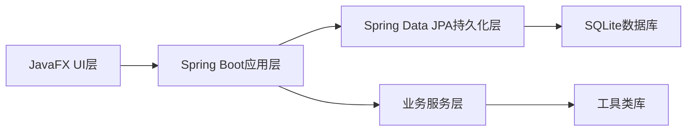

# 宠物管理系统技术方案

## 技术方案概述

### 1. 技术栈选择
- **桌面端框架**：JavaFX 21
- **后端框架**：Spring Boot 3.2.2
- **ORM框架**：Spring Data JPA
- **数据库**：SQLite 3.44.3.0
- **构建工具**：Maven 3.8.6
- **打包工具**：jpackage (Java 21+) + Inno Setup

### 2. 架构设计


## 核心技术要点

### 1. JavaFX UI技术
- 支持现代CSS3样式设计
- 响应式布局适配不同屏幕尺寸
- 富媒体支持（图片、视频等）
- 与Windows系统深度集成

### 2. Spring Boot后端技术
- 自动配置，快速开发
- 集成JPA，简化数据访问
- 声明式事务管理
- 内置测试框架

### 3. 数据库设计
#### 主要表结构
```sql
-- 顾客信息表
CREATE TABLE IF NOT EXISTS customers (
    id INTEGER PRIMARY KEY AUTOINCREMENT,
    customer_name VARCHAR(100) NOT NULL,
    phone VARCHAR(20),
    pet_name VARCHAR(100) NOT NULL,
    pet_type VARCHAR(50),
    pet_breed VARCHAR(100),
    pet_age INTEGER,
    create_time DATETIME DEFAULT CURRENT_TIMESTAMP
);

-- 消费记录表
CREATE TABLE IF NOT EXISTS transactions (
    id INTEGER PRIMARY KEY AUTOINCREMENT,
    customer_id INTEGER,
    transaction_date DATETIME DEFAULT CURRENT_TIMESTAMP,
    service_type VARCHAR(100),
    amount DECIMAL(10,2),
    clerk_id INTEGER,
    commission DECIMAL(10,2),
    notes TEXT,
    FOREIGN KEY (customer_id) REFERENCES customers(id)
);

-- 店员信息表
CREATE TABLE IF NOT EXISTS clerks (
    id INTEGER PRIMARY KEY AUTOINCREMENT,
    clerk_name VARCHAR(100) NOT NULL,
    phone VARCHAR(20),
    commission_rate DECIMAL(5,2) DEFAULT 0.05,
    create_time DATETIME DEFAULT CURRENT_TIMESTAMP
);

-- 照片记录表
CREATE TABLE IF NOT EXISTS photos (
    id INTEGER PRIMARY KEY AUTOINCREMENT,
    customer_id INTEGER,
    transaction_id INTEGER,
    photo_type VARCHAR(20) NOT NULL,
    file_path TEXT NOT NULL,
    file_name TEXT,
    upload_time DATETIME DEFAULT CURRENT_TIMESTAMP,
    FOREIGN KEY (customer_id) REFERENCES customers(id),
    FOREIGN KEY (transaction_id) REFERENCES transactions(id)
);
```

## 资源需求

### 1. 硬件需求
- **开发环境**：至少8GB内存，SSD存储
- **测试环境**：Windows 11系统，至少4GB内存
- **部署环境**：Windows 11系统，至少2GB内存

### 2. 软件需求
- **开发工具**：IntelliJ IDEA 2023.2+，Scene Builder 21
- **数据库工具**：SQLiteStudio 3.4.4
- **打包工具**：Inno Setup 6.2.2
- **设计工具**：Adobe XD或Figma（用于界面设计）

### 3. 人员需求
- **Java开发工程师**：负责后端和前端开发
- **UI/UX设计师**：负责界面设计和用户体验优化
- **测试工程师**：负责系统测试和问题修复

## 风险评估与应对措施

### 1. 技术风险
- **JavaFX学习曲线**：团队成员需要掌握JavaFX开发
  - **应对措施**：提供培训和代码示例
- **SQLite性能限制**：高并发情况下可能出现性能问题
  - **应对措施**：优化SQL查询，添加缓存机制

### 2. 进度风险
- **任务依赖**：某些任务有严格的依赖关系
  - **应对措施**：明确任务顺序，提前规划
- **需求变更**：用户需求可能会变更
  - **应对措施**：采用敏捷开发方法，保持沟通

### 3. 质量风险
- **代码质量**：确保代码符合开发规范
  - **应对措施**：使用代码审查工具，进行单元测试
- **用户体验**：确保界面友好和响应迅速
  - **应对措施**：进行用户测试，优化界面设计

## 总结

本技术方案为宠物管理系统的开发提供了详细的技术指导。通过采用JavaFX和Spring Boot的技术栈，确保了应用的现代性和可维护性。SQLite数据库提供了轻量级的存储方案，适合本地桌面应用场景。分阶段开发和风险评估措施降低了开发复杂度和风险，确保项目能够顺利推进。
