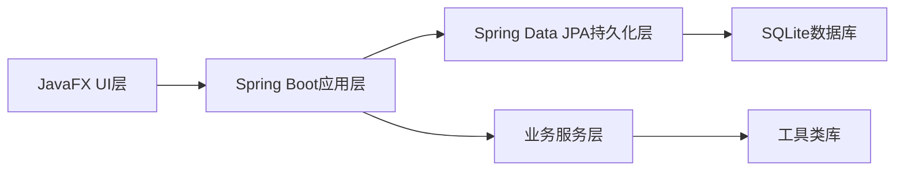
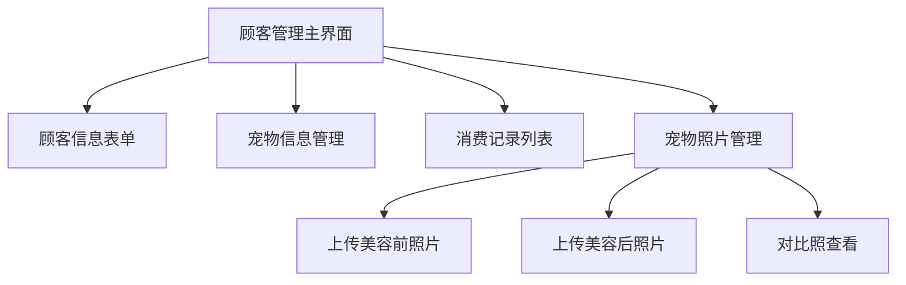
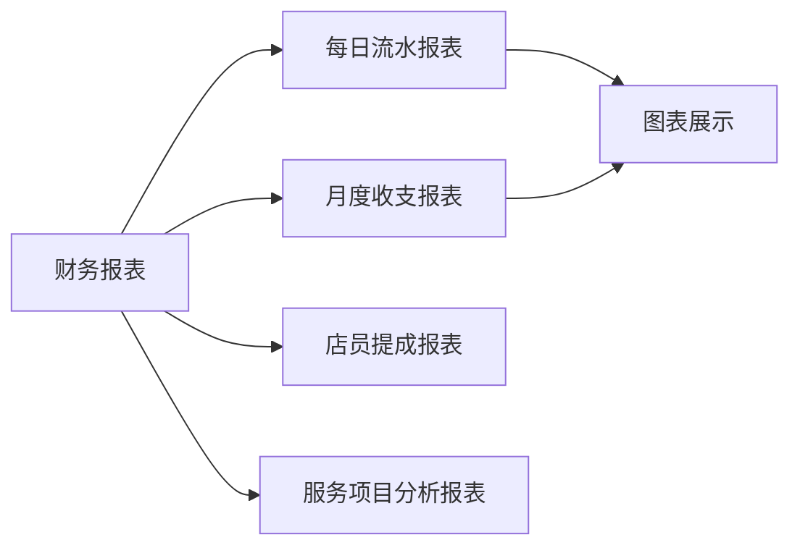

# 宠物管理系统技术方案与任务计划

## 技术方案概述

### 1. 技术栈选择
- **桌面端框架**：JavaFX 21
- **后端框架**：Spring Boot 3.2.2
- **ORM框架**：Spring Data JPA
- **数据库**：SQLite 3.44.3.0
- **构建工具**：Maven 3.8.6
- **打包工具**：jpackage (Java 21+) + Inno Setup

### 2. 架构设计


## 分阶段任务计划

### 阶段一：项目基础架构建设 (预计2天)

**目标**：搭建项目基础架构，配置开发环境

#### 任务清单
- [ ] 创建Maven项目结构
- [ ] 配置pom.xml依赖
- [ ] 创建Spring Boot主应用类
- [ ] 配置SQLite数据库连接
- [ ] 配置JavaFX启动器
- [ ] 创建基础目录结构

**技术要点**：
```xml
<!-- 核心依赖配置 -->
<dependencies>
    <!-- JavaFX -->
    <dependency>
        <groupId>org.openjfx</groupId>
        <artifactId>javafx-controls</artifactId>
        <version>21</version>
    </dependency>
    
    <!-- Spring Boot -->
    <dependency>
        <groupId>org.springframework.boot</groupId>
        <artifactId>spring-boot-starter-data-jpa</artifactId>
        <version>3.2.2</version>
    </dependency>
    
    <!-- SQLite -->
    <dependency>
        <groupId>org.xerial</groupId>
        <artifactId>sqlite-jdbc</artifactId>
        <version>3.44.3.0</version>
    </dependency>
</dependencies>
```

**验收标准**：
- 项目能正常编译和启动
- Spring Boot应用能连接到SQLite数据库
- JavaFX界面能正常显示

---

### 阶段二：数据库设计与实现 (预计1.5天)

**目标**：设计数据库结构，创建实体类和Repository接口

#### 任务清单
- [ ] 设计数据库表结构
- [ ] 创建实体类（Customer、Transaction、Clerk、Photo）
- [ ] 创建Repository接口
- [ ] 配置JPA属性
- [ ] 初始化数据库连接池

**核心代码**：
```java
@Entity
@Table(name = "customers")
public class Customer {
    @Id
    @GeneratedValue(strategy = GenerationType.IDENTITY)
    private Long id;
    
    @Column(nullable = false, length = 100)
    private String customerName;
    
    @Column(length = 20)
    private String phone;
    
    @Column(length = 100)
    private String petName;
    
    @Column(length = 50)
    private String petType;
    
    @Column(length = 100)
    private String petBreed;
    
    private Integer petAge;
    
    @OneToMany(mappedBy = "customer", cascade = CascadeType.ALL)
    private List<Transaction> transactions;
    
    @OneToMany(mappedBy = "customer", cascade = CascadeType.ALL)
    private List<Photo> photos;
    
    // 构造方法、getter和setter
}
```

**验收标准**：
- 数据库表能自动创建
- 实体类与数据库表映射正确
- Repository接口能正常执行CRUD操作

---

### 阶段三：顾客信息管理功能实现 (预计3天)

**目标**：实现顾客信息、宠物信息和宠物照片管理功能

#### 任务清单
- [ ] 创建顾客信息管理界面
- [ ] 实现顾客信息的增删改查
- [ ] 实现宠物信息管理
- [ ] 实现消费记录管理
- [ ] 实现宠物美容前后对比照管理
- [ ] 创建相关的业务服务类

**界面设计**：


**核心功能**：
```java
@Service
public class CustomerService {
    
    @Autowired
    private CustomerRepository customerRepository;
    
    public Customer saveCustomer(Customer customer) {
        return customerRepository.save(customer);
    }
    
    public List<Customer> findAllCustomers() {
        return customerRepository.findAll();
    }
    
    public List<Customer> findCustomersByPetName(String petName) {
        return customerRepository.findByPetName(petName);
    }
}
```

**验收标准**：
- 顾客信息能正常录入和查询
- 宠物信息管理功能正常
- 消费记录能正确关联到顾客
- 宠物照片能正常上传和查看

---

### 阶段四：财务管理功能实现 (预计2.5天)

**目标**：实现店铺流水统计、店员提成管理和财务报表功能

#### 任务清单
- [ ] 创建财务管理界面
- [ ] 实现店铺流水统计功能
- [ ] 实现店员提成设置
- [ ] 实现每笔交易提成计算
- [ ] 实现财务报表生成
- [ ] 实现报表导出功能（PDF/Excel）

**提成计算逻辑**：
```java
@Service
public class FinanceService {
    
    @Autowired
    private TransactionRepository transactionRepository;
    
    @Autowired
    private ClerkRepository clerkRepository;
    
    public BigDecimal calculateCommission(Long transactionId) {
        Transaction transaction = transactionRepository.findById(transactionId)
                .orElseThrow(() -> new RuntimeException("交易不存在"));
        
        if (transaction.getClerk() == null) {
            return BigDecimal.ZERO;
        }
        
        return transaction.getAmount().multiply(
                transaction.getClerk().getCommissionRate()
        );
    }
    
    public List<Transaction> findTransactionsByDateRange(
            LocalDate startDate, LocalDate endDate) {
        return transactionRepository.findByTransactionDateBetween(
                startDate.atStartOfDay(), endDate.atTime(23, 59, 59));
    }
}
```

**财务报表设计**：


**验收标准**：
- 店铺流水统计准确
- 店员提成计算正确
- 财务报表能正常生成
- 报表导出功能正常

---

### 阶段五：系统集成与测试 (预计2天)

**目标**：集成所有功能模块，进行系统测试

#### 任务清单
- [ ] 集成JavaFX UI层与Spring Boot后端
- [ ] 进行单元测试
- [ ] 进行集成测试
- [ ] 进行用户界面测试
- [ ] 修复发现的问题
- [ ] 优化系统性能

**测试重点**：
- 数据库操作的正确性
- 业务逻辑的完整性
- 用户界面的响应性
- 照片上传和查看功能
- 财务计算的准确性

**验收标准**：
- 所有单元测试通过
- 主要业务功能正常运行
- 用户界面友好且响应迅速
- 系统性能符合要求

---

### 阶段六：打包与部署 (预计1天)

**目标**：将应用打包成Windows 11可执行文件

#### 任务清单
- [ ] 配置jpackage打包参数
- [ ] 创建Windows安装程序
- [ ] 测试打包后的应用
- [ ] 创建使用说明书
- [ ] 准备部署环境

**打包配置**：
```powershell
# 使用jpackage打包成Windows安装程序
jpackage --name "宠物管理系统" --input target/ --main-jar pet-management-system-1.0.0.jar --main-class com.pet.management.MainApplication --type msi --app-version 1.0.0 --vendor "宠物管理系统" --copyright "© 2024 宠物管理系统" --icon src/main/resources/icon.ico --win-dir-chooser --win-menu --win-shortcut --java-options "-Xms512m -Xmx1024m"
```

**验收标准**：
- 生成可在Windows 11上运行的安装程序
- 应用能正常安装和启动
- 所有功能在打包后的应用中正常运行
- 安装程序界面美观且操作简单

---

## 资源需求

### 1. 硬件需求
- **开发环境**：至少8GB内存，SSD存储
- **测试环境**：Windows 11系统，至少4GB内存
- **部署环境**：Windows 11系统，至少2GB内存

### 2. 软件需求
- **开发工具**：IntelliJ IDEA 2023.2+，Scene Builder 21
- **数据库工具**：SQLiteStudio 3.4.4
- **打包工具**：Inno Setup 6.2.2
- **设计工具**：Adobe XD或Figma（用于界面设计）

### 3. 人员需求
- **Java开发工程师**：负责后端和前端开发
- **UI/UX设计师**：负责界面设计和用户体验优化
- **测试工程师**：负责系统测试和问题修复

---

## 风险评估与应对措施

### 1. 技术风险
- **JavaFX学习曲线**：团队成员需要掌握JavaFX开发
  - **应对措施**：提供培训和代码示例
- **SQLite性能限制**：高并发情况下可能出现性能问题
  - **应对措施**：优化SQL查询，添加缓存机制

### 2. 进度风险
- **任务依赖**：某些任务有严格的依赖关系
  - **应对措施**：明确任务顺序，提前规划
- **需求变更**：用户需求可能会变更
  - **应对措施**：采用敏捷开发方法，保持沟通

### 3. 质量风险
- **代码质量**：确保代码符合开发规范
  - **应对措施**：使用代码审查工具，进行单元测试
- **用户体验**：确保界面友好和响应迅速
  - **应对措施**：进行用户测试，优化界面设计

---

## 总结

本技术方案和任务计划为宠物管理系统的开发提供了详细的指导。通过分阶段开发，每个阶段的任务相对独立，降低了开发复杂度和风险。采用JavaFX和Spring Boot的技术栈，确保了应用的现代性和可维护性。通过合理的任务分配和进度管理，预计可以在11天内完成开发并部署到Windows 11系统。
